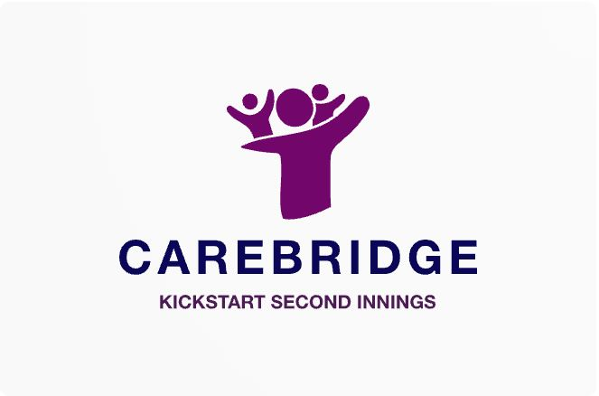
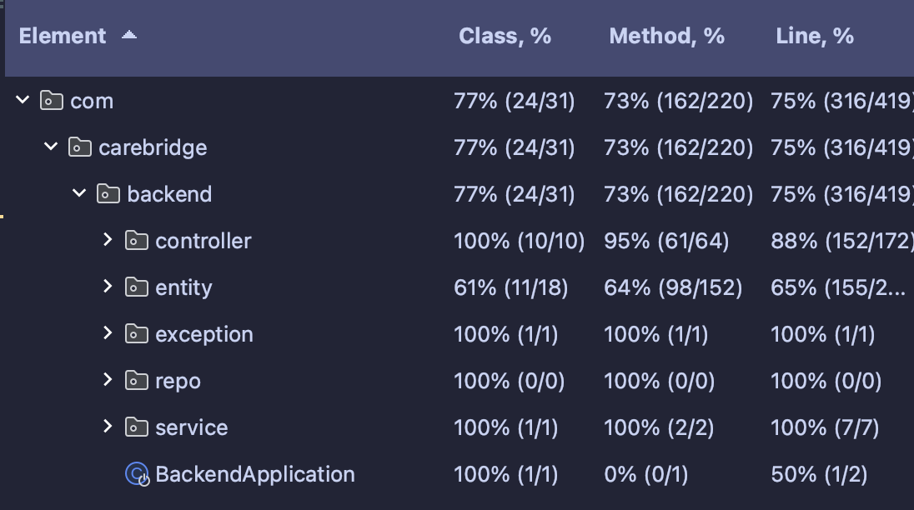

# CareBridge

## Overview
CareBridge is a mobile application designed to provide a one-stop solution to senior citizens, family members, and volunteers. Use cases for the application are as mentioned below:
 - Senior Citizens:
   - Get medicine reminders
   - Get checklists for groceries
   - Pair with family members
 - Family Members:
   - Can book appointments with volunteers
   - Pair with senior citizens
   - Update / Create checklists for elderly people
 - Volunteers:
   - Get info on senior citizens
   - Provide availability in Appointments

Other miscellaneous features include:
 - Fall Detection for senior citizens (using Accelerometer and Gyroscope)
 - Email services for all members
 - Push notifications for all members

To read more about the dependencies, refer to the `readme.md` mentioned in the respective folders.
## How to use it
### Front End
Install expo - To render the app.
``` bash
npm install --global expo-cli
```
Install eas - To build the app.
``` bash
npm install -g eas-cli
```
Install all dependencies
``` bash
cd .\CareBridgeUi\
npm i
```
To Run the app you need [DaLVPN](https://www.dal.ca/dept/its/new.html#:~:text=Learn%20more%20about%20VPN)
#### Step 1
Create your own expo account @ [Link.](https://expo.dev/signup)
Install [Expo Go](https://play.google.com/store/apps/details?id=host.exp.exponent&hl=en&gl=US&pli=1) app on your phone.
#### Step 2
Login to your expo account in terminal inside carebridgeui.
```
cd .\CareBridgeUi\
npx expo login
```
Enter the email and password after you signed up your expo account.
#### Step 3
Run the expo app
```
npm start
```
Press s to switch to switch to expo go.
#### Step 4
Scan the code and open in ExpoGo
Make sure you are connected to the DalVPN.


### Back End
The entire backend folder can be utilized as a separate maven project. Steps to run the project on your local machine:
 - Import the Backend folder in IntelliJ
 - In build configurations, click on **Run / Debug Configurations** > **Edit Configurations**
 - Add a Spring Boot configuration with the below config (To run locally):
   - **Build & Run:** (SDK: Java 21) `com.carebridge.backend.BackendApplication`
 - Add a Maven configuration with the below config (To create a **jar** file):
   - **Run:** `package -DskipTests`


### Database
This project uses MySql as its backend database.

### Test Coverage
